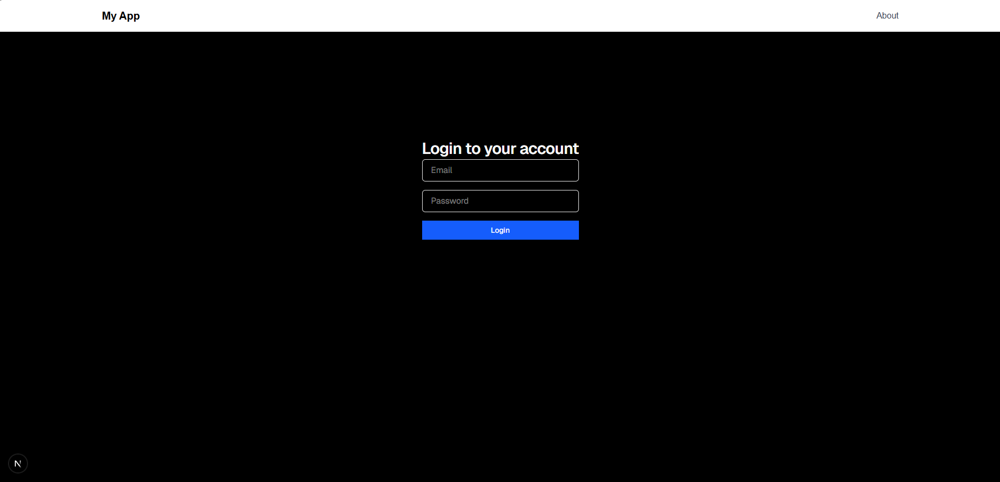
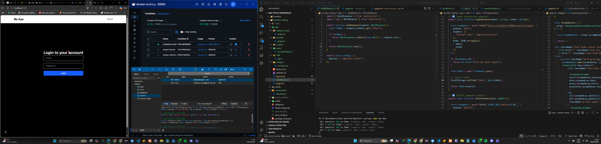
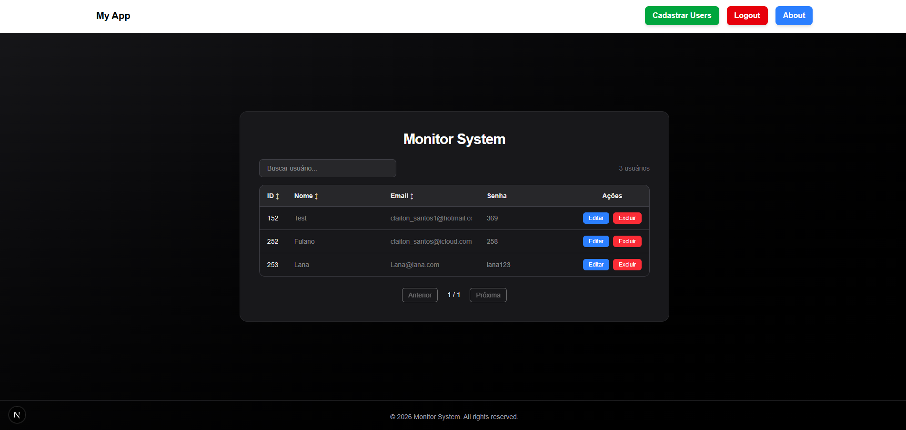
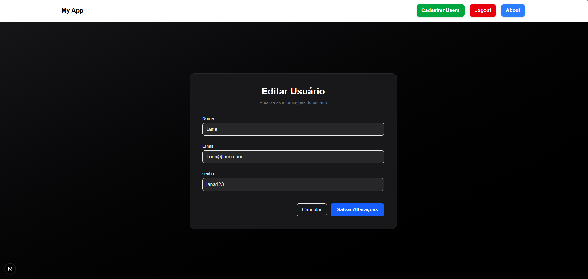
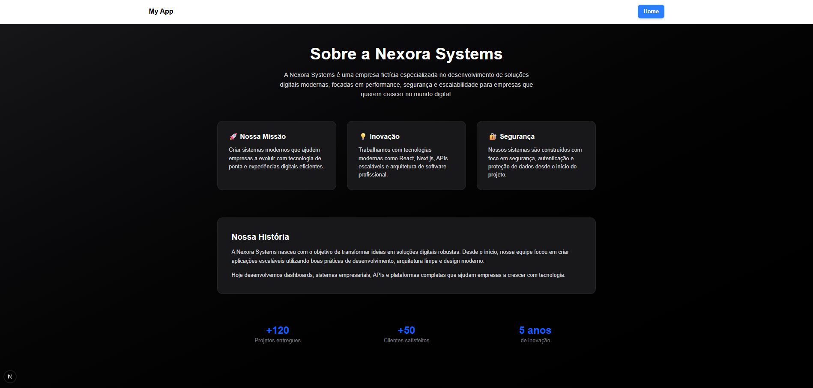

# Sistema de Monitoramento e Gestão de Usuários

## 📌 Sobre o projeto

Este projeto foi desenvolvido utilizando **Next.js** no frontend e uma **API em Java com Spring Boot** no backend.
A aplicação tem como objetivo permitir o gerenciamento de usuários de forma segura, utilizando autenticação baseada em **JWT (JSON Web Token)**.

A plataforma foi pensada para ser utilizada por equipes técnicas como:

* Analista de Sistemas
* Suporte Técnico N1
* Suporte Técnico N2
* DBA (Database Administrator)

O sistema consome uma API externa responsável por autenticação e gerenciamento de dados dos usuários.

---

## 🔐 Autenticação e Segurança

A aplicação possui um sistema de autenticação baseado em **token JWT**, onde:

1. O usuário realiza login no sistema.
2. A API valida as credenciais.
3. Um token JWT é gerado.
4. O token é utilizado para autorizar o acesso às rotas protegidas.
5. A sessão possui **tempo de expiração**, aumentando a segurança da aplicação.

---

## 🧩 Tecnologias utilizadas

### Frontend

* Next.js
* React
* TypeScript
* Fetch API
* Componentização de interface

### Backend

* Java
* Spring Boot
* JWT (JSON Web Token)
* API REST

---

## 🏗️ Arquitetura do projeto

Frontend (Next.js)

* Componentes reutilizáveis
* Integração com API
* Controle de autenticação
* Proteção de rotas

Backend (API)

* Docker
* Gerenciamento de usuários
* Autenticação JWT
* Validação de dados
* Controle de acesso

---

## 👨‍💻 Funcionalidades do sistema

### Login seguro

* Autenticação com token
* Sessão com expiração
* Proteção de rotas

### Monitoramento de usuários

* Listagem de usuários
* Consulta de dados cadastrais
* Controle de acesso

### Atualização de informações

Usuários autorizados podem:

* Atualizar dados de cadastro
* Gerenciar informações de usuários
* Manter dados atualizados no sistema

---

## 🧑‍💼 Escopo de atuação do Suporte Técnico

### Suporte Técnico N1

Responsável por:

* Visualizar usuários cadastrados
* Identificar problemas de acesso
* Auxiliar na validação de dados
* Registrar incidentes iniciais
* Encaminhar problemas mais complexos

---

### Suporte Técnico N2

Responsável por:

* Atualizar informações de usuários
* Analisar inconsistências no cadastro
* Realizar correções em dados
* Apoiar o time de desenvolvimento
* Interagir com o banco de dados quando necessário

---

### Analista de Sistemas

Atua em:

* Análise de processos
* Evolução da aplicação
* Melhoria de funcionalidades
* Integração entre frontend e backend
* Definição de regras de negócio

---

### DBA (Database Administrator)

Pode:

* Monitorar integridade dos dados
* Avaliar estrutura do banco
* Auxiliar em otimizações
* Validar alterações críticas
* Garantir segurança das informações

---

## 🚀 Objetivo do projeto

O objetivo deste projeto é demonstrar uma arquitetura moderna de aplicação web com:

* Frontend desacoplado
* API segura
* Autenticação com token
* Controle de acesso por sessão
* Integração entre sistemas

Este projeto também pode ser utilizado como **base para sistemas corporativos de gestão de usuários e monitoramento operacional**.

---

## 📈 Possíveis melhorias futuras

* Controle de permissões por perfil
* Dashboard administrativo
* Logs de auditoria
* Integração com sistemas corporativos
* Deploy em ambiente cloud
* Monitoramento em tempo real

---

## Tela de Login

## Dashboard do Sistema

## Monitoramento de Usuários

## Atualização de Usuários

## About de uma Empresa ficticia - Nexora Systems

## 👨‍💻 Autor

Projeto desenvolvido para fins de estudo, prática profissional e portfólio na área de desenvolvimento Full Stack.
